# Introduction

Use of `goal` package for the optimal placement of Ground-Truth Points (GCP) for UAV missions. We use the `uav` group of functions inside `goal` library.

# Example Data in _goal_ package

The goal package includes a sample dataset (`goaldata.data2`) for the presentation of the _uav_ examples. 


```r
library(sp)
library(goal)

data("goaldata.data2", package = "goal")
print(goaldata.data2) 
```

```
##          x        y
## 1 25.92548 39.13743
## 2 25.92970 39.13591
## 3 25.92927 39.13500
## 4 25.92489 39.13641
## 5 25.92548 39.13743
```

```r
#xy=data.frame(x=c(25.92548,25.92970,25.92927,25.92489,25.92548), y=c(39.13743,39.13591,39.13500,39.13641,39.13743 )) 
#coordinates(xy) <- ~x+y
#plot(xy)
```

These 5 points define a polygon area which is the area of our case study.
We then use the _'uav.GenerateTargets'_ function to generate all possible targets in this area.

 


```r
one = uav.GenerateTargets(goaldata.data2)
```

```
## 
## uav.GenerateTargets: reprojecting 'data2' to: '+init=epsg:2100'. I continue.
```

```r
par(mar=c(0, 0, 0, 0))
plot(one$Polygon)
plot(one$simia, col= as.numeric(as.factor(one$simia$type)), add=TRUE,  
     pch=3*as.numeric(as.factor(one$simia$type)) )
plot(one$lines, add=T)
text(one$simia , labels = one$simia$id, col="brown", pos=2)
```

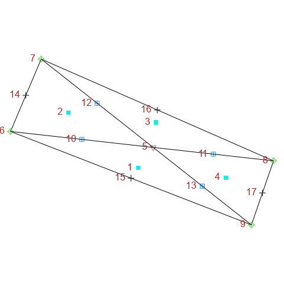

```r
#library(rgdal)
#rgdal::writeOGR(one$simia,dsn=paste0("Targets.shp"),layer="Targets",driver="ESRI Shapefile", overwrite_layer = T)
```

As you can see in the figure above, we generated 17 targets inside this polygon. These points are quite a few, and we need to reduce them. We use the _'uav.DoReduction'_ function for reducing the number of "targets" based on the density of points. 

Using the _'uav.DoReduction'_ function we need to define a cell size which will be used for the calculation of points density.

The plots bellow, show the calculation of focal density of points, under various cell sizes (5, 10, 15), in the study area and return a frequency table of number of cells per pixels:


```r
library(knitr)

par(mar=c(0, 0, 3, 0))
five = uav.showFocal(insimia = one$simia, inpol=one$Polygon, toplot = T, size = 5) 
```

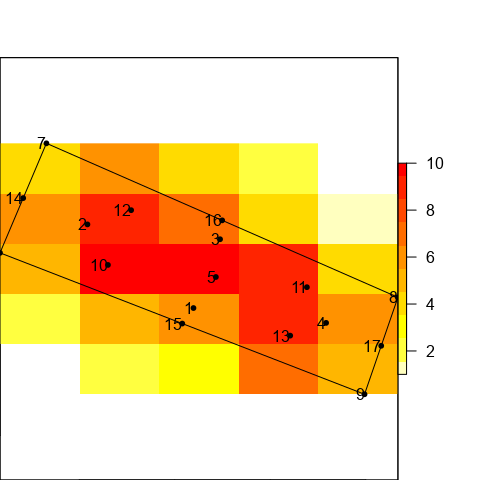

```r
kable(as.data.frame(five), col.names=c("Number of points","Frequency"))
```


|Number of points | Frequency|
|:----------------|---------:|
|1                |         1|
|2                |         3|
|3                |         1|
|4                |         4|
|5                |         3|
|6                |         4|
|7                |         2|
|9                |         3|
|10               |         2|

```r
ten = uav.showFocal(insimia = one$simia, inpol=one$Polygon, toplot = T, size = 10)
```

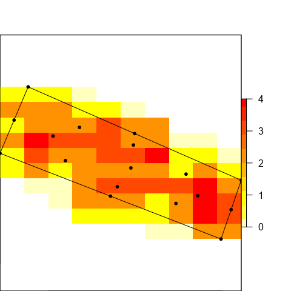

```r
kable(as.data.frame(ten), col.names=c("Number of points","Frequency"))
```


|Number of points | Frequency|
|:----------------|---------:|
|0                |        10|
|1                |        18|
|2                |        28|
|3                |        13|
|4                |         5|

```r
fifteen = uav.showFocal(insimia = one$simia, inpol=one$Polygon, toplot = T, size = 15)
```

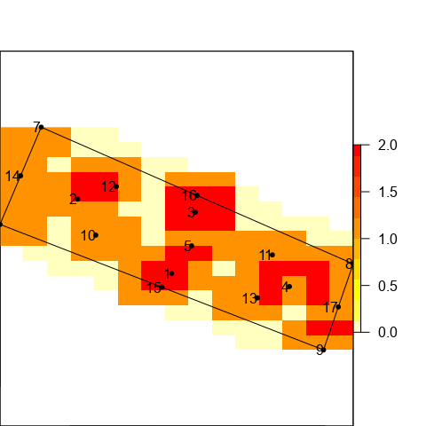

```r
 kable(as.data.frame(fifteen), col.names=c("Number of points","Frequency"))
```


|Number of points | Frequency|
|:----------------|---------:|
|0                |        41|
|1                |        79|
|2                |        28|

These were the generated target points inside the polygon of the study area.

Points Reduction
===

Now we will use focal size 10 and will reduce the target-points in the area. We use the _`DoReduction`_ function:

```r
result = goal::uav.DoReduction(one, insize=10)
```

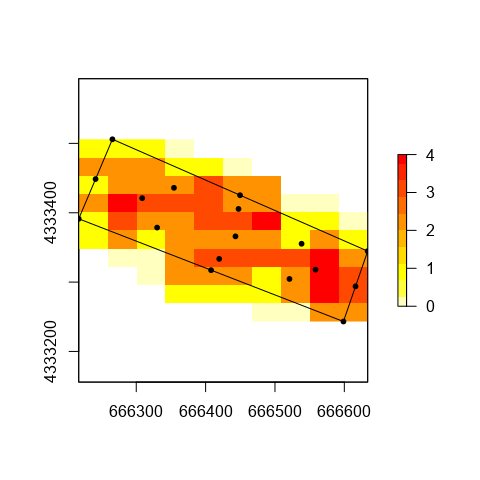<!-- -->[1] "Removed point id:3"
<!-- -->[1] "Removed point id:1"
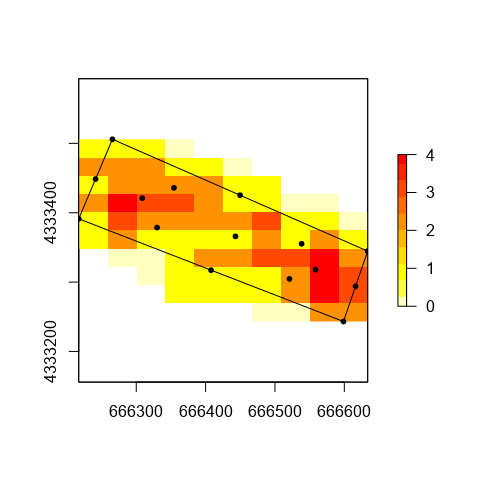<!-- -->[1] "Removed point id:4"
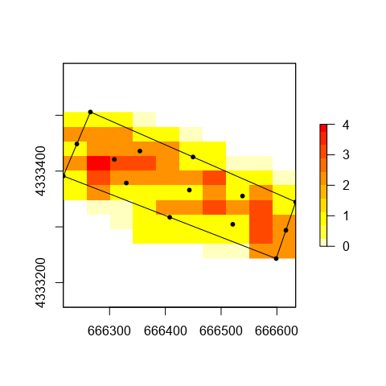<!-- -->[1] "Removed point id:2"
<!-- -->[1] "Removed point id:11"
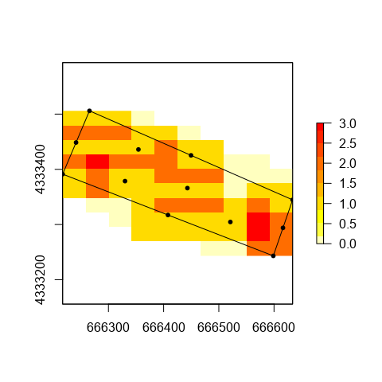<!-- -->[1] "Removed point id:8"
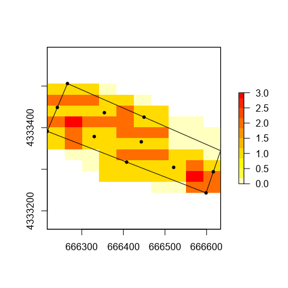<!-- -->[1] "Removed point id:9"
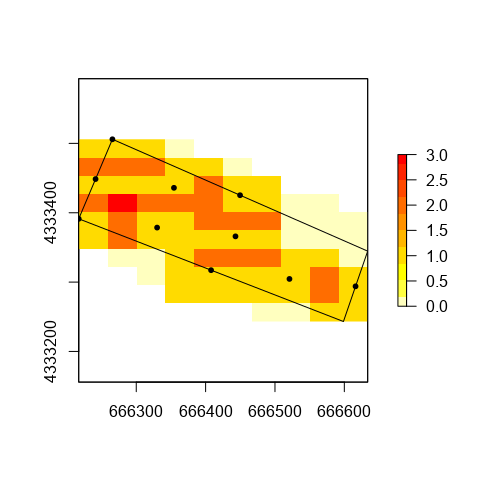<!-- -->[1] "Removed point id:5"
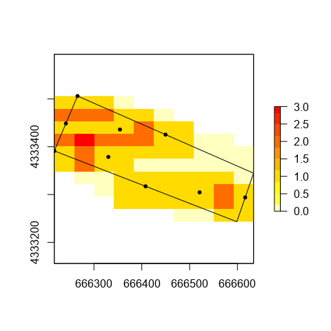<!-- -->[1] "Removed point id:7"
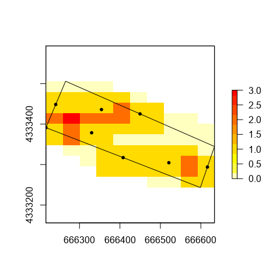<!-- -->[1] "Removed point id:10"
<!-- -->

Now we get the results from each ste of reduction:


```r
par(mar=c(0, 0, 3, 0))
plot(one$Polygon, main=paste0(length(one$simia)," initial points in grey\n",length(result)," final points in blue"))
#plot(one$simia, col="blue", add=TRUE, pch=20)
plot(one$simia,  add=TRUE, col="grey")
text(one$simia, labels=one$simia$id, pos=4, col="grey")

plot(result, col="blue", pch=20, add=TRUE)
text(result, labels=result$id, pos=2, col="navyblue")
```

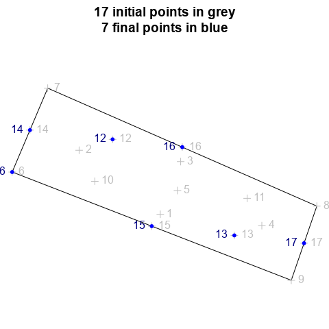

